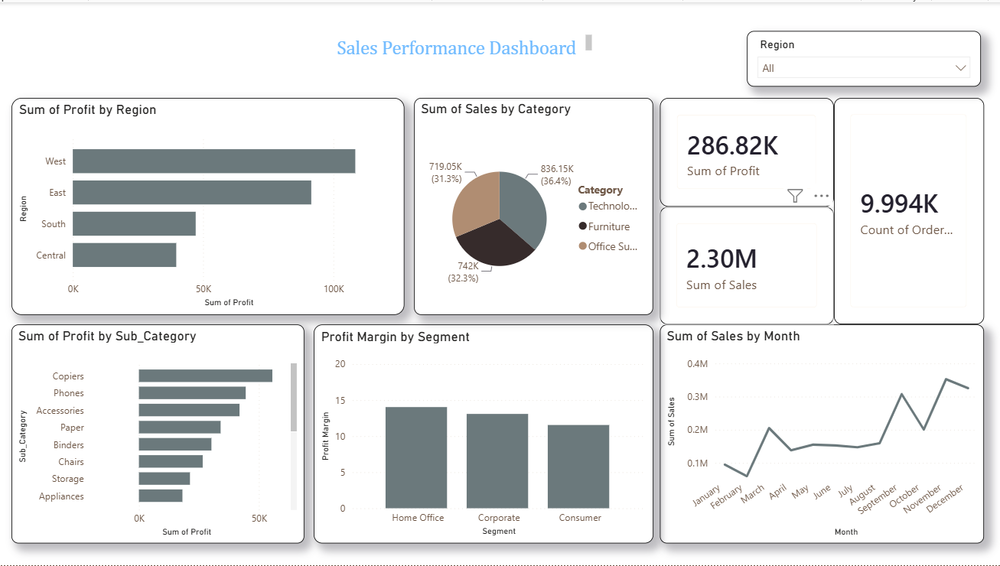

# Sales Analysis Dashboard

A data analysis project exploring profitability, sales trends, and customer behavior using SQL Server and Power BI, built on the Superstore sales dataset.

## What this project does
- Cleaned and explored order-level sales data in SQL Server (joins, CTEs, window functions, subqueries)
- Identified key profitability drivers by region, product sub-category, month, and customer segment
- Built an interactive Power BI dashboard with KPI cards, filters, and visual breakdowns

## Key Findings
- Central region has the lowest profit of all regions
- "Tables" is the only sub-category losing money — driven by thin margins, not just discounting
- Sales peak sharply in December (holiday season)
- Return rates are consistent (~8%) across all categories
- Home Office is the most profitable customer segment

## Files
- `sales_analysis_queries.sql` — all SQL exploration and analysis queries
- `Sample_dataset.xlsm` — Excel workbook with KPI summary and pivot tables
- `Sales_Analysis_Case_Study.md` — full write-up of the project and findings

## Dashboard Preview

## Tools Used
SQL Server · Power BI · Excel
